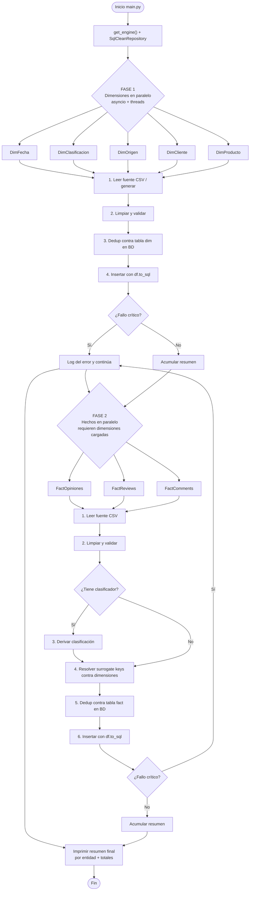

# Diagrama de flujo del proceso ETL

Archivo con el diagrama en formato Mermaid. Pasa este archivo a una IA y pídele
"genera una imagen PNG/SVG de este diagrama Mermaid" (o ábrelo en
https://mermaid.live y exporta la imagen).

